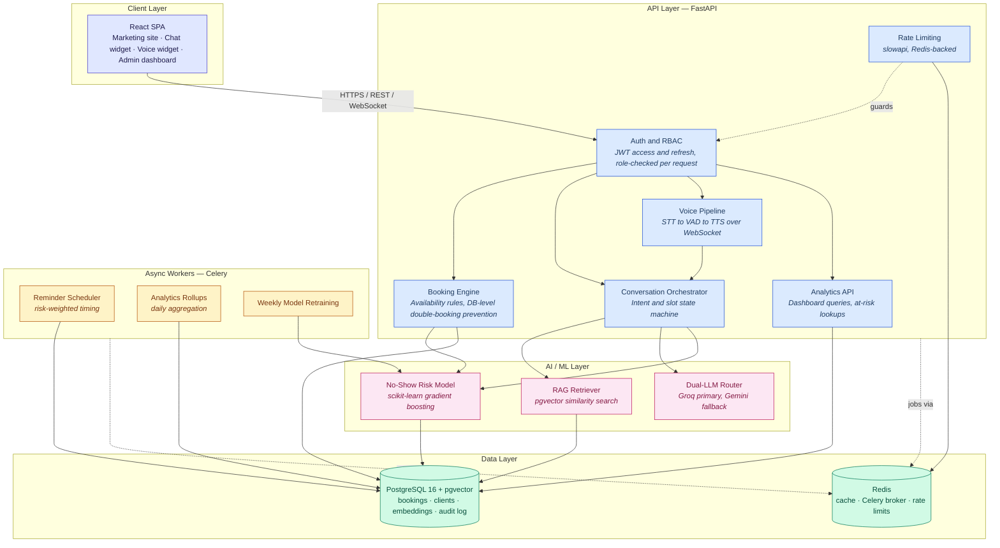

# GlowDesk

**An AI-native booking platform that turns no-shows from a silent revenue leak into a solved, measured problem.**


---

## Overview

GlowDesk is a full-stack SaaS reference build for appointment-based small businesses — salons and spas specifically, though the domain generalizes to any slot-booking business. It combines a client-facing marketing site, a conversational (text **and** voice) booking assistant, a database-enforced conflict-free booking engine, and a machine-learning risk model that predicts which appointments are likely to be no-shows *before they happen* — all surfaced through an owner-facing analytics dashboard.

It was built end-to-end from a single 13-phase master plan (see [`salon-booking-saas-dev-plan.md`](salon-booking-saas-dev-plan.md)), with every phase independently verified against real infrastructure — a live Postgres instance, a live Redis broker, real embedding and ML models — rather than mocks.

## The Business Problem

No-shows are one of the largest silent revenue leaks in appointment-based small businesses. Industry estimates commonly put no-show rates at **10–20%+ of booked slots**, and every one of them is chair-time or table-time that can never be resold once the moment passes.

The tools most small businesses use today make this worse in two compounding ways:

- **They treat every client identically.** A generic SMS reminder sent 24 hours before every appointment does nothing to distinguish a loyal client with a five-visit history from a first-time booker who has never shown up on time.
- **They add friction at the exact moment a business wants to remove it.** Rigid calendar-grid UIs push clients toward abandoning the booking entirely, especially on mobile, especially for a quick, casual request like *"can I get a haircut next Saturday afternoon?"*

Solving only one half of this problem — a nicer booking UI, or a smarter reminder system — leaves real money on the table. GlowDesk was built to solve both halves together.

## What I Built

- A **conversational booking assistant** (text chat and voice) that turns natural-language requests into confirmed appointments in a handful of turns, without asking clients to think in calendar-grid terms.
- A **booking engine with database-enforced conflict safety** — double-bookings are prevented at the PostgreSQL constraint level, not just in application logic, and this is verified under real concurrent load, not assumed.
- A **no-show risk model** (gradient boosting, scikit-learn) trained on the same features it scores live with, so there is no train/serve skew — every new booking is scored the moment it's created.
- A **risk-driven reminder engine** (Celery Beat) that adjusts *when* and *how* a reminder goes out based on that score, instead of a fixed one-size-fits-all offset.
- A **retrieval-augmented FAQ system** (pgvector) so the majority of routine questions — hours, pricing, policies — are answered from a knowledge base instead of an LLM call.
- A **dual-provider LLM router** (Groq primary, Gemini fallback) used only for the residual cases RAG and rule-based slot-filling can't handle, keeping per-booking token spend low and the assistant resilient to any single provider's outage or rate limit.
- An **owner-facing analytics dashboard** — bookings over time, service popularity, staff utilization, channel breakdown, and a live at-risk-appointments list with one-click reminder dispatch.
- A **security and compliance pass**: rate limiting, JWT hardening, GDPR-style self-service data deletion, and a documented, item-by-item security checklist.

## How It Solves the Problem

| Business problem | GlowDesk's answer |
|---|---|
| Booking friction turns interest into abandonment | A conversational assistant collects intent in natural language and confirms in-line — no calendar grid required |
| Every client gets treated the same reminder | The no-show model personalizes reminder timing and framing per booking, based on real risk signals (lead time, prior no-show history, day/time pattern, first-time-client status) |
| Reminders are reactive, not preventative | Risk scores are computed **at booking time**, not the night before — the business has the full lead time to act (deposit request, overbooking a high-risk slot, a personal call) |
| Owners can't see the leak, so they can't fix it | The analytics dashboard turns raw booking history into a concrete, always-current view of where revenue is at risk |

## Architecture



**Request flow, in short:** the React SPA talks to FastAPI exclusively over authenticated HTTPS/WebSocket. The API layer never calls an LLM directly for booking logic — the conversation orchestrator first tries rule-based slot-filling, then RAG for FAQ-shaped questions, and only escalates to the LLM router for genuinely ambiguous free text. Every booking write goes through the booking engine, which relies on a Postgres `EXCLUDE` constraint (not application-level locking) to make double-booking structurally impossible, and immediately triggers a no-show risk score. Celery workers, decoupled from the request/response cycle via Redis, own everything that isn't latency-sensitive: reminders, analytics rollups, and weekly model retraining.

## Engineering Highlights

These are the parts of the build that go beyond wiring a CRUD app to an LLM:

- **Concurrency-safe booking, proven under load.** Double-booking prevention uses a PostgreSQL `EXCLUDE` constraint, and the test suite proves it: five identical booking requests fired simultaneously via `asyncio.gather` against the same slot resolve to exactly one `201 Created` and four `409 Conflict` — verified against a real database, not simulated.
- **Train/serve feature parity by construction.** `app/ml/features.py` is the single schema both the offline trainer and the live-scoring path import from, so the two can't silently drift apart — a common source of quietly-wrong production ML.
- **Token-minimized LLM usage by design, not by accident.** The conversation orchestrator resolves intent through a rule-based state machine and pgvector RAG first; the Groq/Gemini router is a last resort, with automatic failover if the primary provider errors or rate-limits.
- **Security hardening treated as a checklist, not an afterthought.** Redis-backed rate limiting on auth/booking/chat endpoints, hand-crafted JWT "none-algorithm" attack tests, SQLi-shaped input rejected at the validation layer, and a GDPR-style self-service anonymizing deletion endpoint — all itemized against the plan's own security requirements in [`docs/SECURITY_CHECKLIST.md`](docs/SECURITY_CHECKLIST.md).
- **Every phase verified against real infrastructure.** Each of the 13 build phases was checked against an ephemeral, real Postgres + Redis stack and real embedding/ML models before being marked done — never against mocks standing in for the hard parts.
- **Honest scope boundaries.** Every deliberate shortcut — the offline TTS fallback, the synthetic ML training data, the absence of frontend login pages — is disclosed with its reasoning and upgrade path in [`docs/KNOWN_LIMITATIONS.md`](docs/KNOWN_LIMITATIONS.md), rather than silently shipped as if it were a finished feature.

## Tech Stack

| Layer | Technology |
|---|---|
| **Backend** | FastAPI, SQLAlchemy 2.0 (async), Alembic, Pydantic v2 |
| **Database** | PostgreSQL 16 with the `pgvector` extension |
| **Cache / Queue** | Redis, Celery (worker + beat) |
| **Frontend** | React 18, TypeScript, Vite, Tailwind CSS, TanStack Query, Zustand, Recharts, Framer Motion |
| **Conversational AI** | Groq (`openai/gpt-oss-20b`) primary LLM, Gemini Flash / Flash-Lite fallback, `BAAI/bge-small-en-v1.5` embeddings |
| **Voice** | `faster-whisper` (STT), `pyttsx3` offline TTS by default with an OpenVoice V2 integration point, custom energy-based VAD |
| **Machine Learning** | scikit-learn gradient boosting (no-show risk), with a logistic-regression companion model |
| **Security** | `slowapi` (Redis-backed rate limiting), JWT access/refresh rotation, RBAC re-verified per request |
| **CI/CD** | GitHub Actions — lint, type-check, tests, and a Docker image build for both services on every push/PR |

## Project Structure

```
backend/
  app/
    api/v1/       REST + WebSocket endpoints (auth, appointments, conversation, voice, analytics, ...)
    ai/           LLM router, RAG, embeddings, orchestrator, STT/TTS/VAD
    ml/           feature schema, training, live-scoring (shared contract between the two)
    booking/      availability rules and conflict-safe appointment creation
    tasks/        Celery tasks — reminders, analytics rollups, model retraining
    db/models/    SQLAlchemy models
    core/         config, rate limiting
  alembic/        database migrations
  tests/          pytest suite (backend logic, security, concurrency)
frontend/
  src/
    pages/        marketing site (Home, Services, About, Contact) + Admin dashboard
    components/   chat widget, layout, shared UI
    hooks/        data-fetching and voice-session hooks
    lib/          typed API clients
docs/             deployment guide, security checklist, retraining runbook, known limitations
infra/            production hardening scripts (restricted DB role, backups)
```

## Getting Started

1. **Configure environment variables:**

   ```bash
   cp .env.example .env
   ```

   Fill in free-tier API keys for Groq and Gemini (see [Tech Stack](#tech-stack) above); every other variable has a sensible local default.

2. **Bring up the full stack:**

   ```bash
   docker compose up --build
   ```

   This starts Postgres (with `pgvector`), Redis, the FastAPI backend, the Celery worker and beat scheduler, and the Vite dev server.

3. **Apply database migrations:**

   ```bash
   cd backend
   alembic upgrade head
   ```

4. **Seed starter data** (optional, but recommended so the app isn't empty on first run):

   ```bash
   cd backend
   python -m scripts.seed_faq
   python -m scripts.generate_synthetic_data --rows 20000 --out data/synthetic_appointments.csv
   python -m app.ml.train --data-path data/synthetic_appointments.csv
   python -m scripts.backfill_analytics --days 90
   ```

- **Backend API:** http://localhost:8000 — interactive docs at `/docs`, ReDoc at `/redoc` (auto-generated by FastAPI, no extra work needed)
- **Frontend:** http://localhost:5173 (marketing site + chat/voice widget), http://localhost:5173/admin (analytics dashboard)

## Running Tests

```bash
# Backend
cd backend && pip install -r requirements-dev.txt && pytest

# Frontend
cd frontend && npm install && npm run test
```

CI (`.github/workflows/ci.yml`) runs lint, type-check, tests, and a Docker build for both services, plus dependency vulnerability scanning, on every push and pull request.

## Further Documentation

- [`docs/DEPLOYMENT.md`](docs/DEPLOYMENT.md) — deploying to Supabase, Upstash, Render/Fly.io, and Vercel/Netlify, entirely on free tiers.
- [`docs/SECURITY_CHECKLIST.md`](docs/SECURITY_CHECKLIST.md) — the plan's security requirements, item by item, with implementation status.
- [`docs/RUNBOOK_MODEL_RETRAINING.md`](docs/RUNBOOK_MODEL_RETRAINING.md) — moving the no-show model from synthetic to real booking data.
- [`docs/KNOWN_LIMITATIONS.md`](docs/KNOWN_LIMITATIONS.md) — every deliberate scope decision made during development, and what upgrading each would take.
- [`salon-booking-saas-dev-plan.md`](salon-booking-saas-dev-plan.md) — the original master development plan this build follows.

## Project Status

All 13 phases of the development plan are implemented and independently verified:

| Phase | Scope |
|---|---|
| 0–2 | Scaffolding, auth/RBAC, booking engine with DB-level double-booking prevention |
| 3–6 | No-show ML pipeline, reminder engine, RAG FAQ answering, dual-LLM router with failover |
| 7–8 | Conversation orchestrator (text + voice) with a token-minimized, rule-first design |
| 9–10 | Owner analytics dashboard, public marketing site |
| 11–13 | Security hardening, CI/CD + deployment docs, this documentation pass |

See [`docs/KNOWN_LIMITATIONS.md`](docs/KNOWN_LIMITATIONS.md) for what's deliberately out of scope today and how to extend it.
